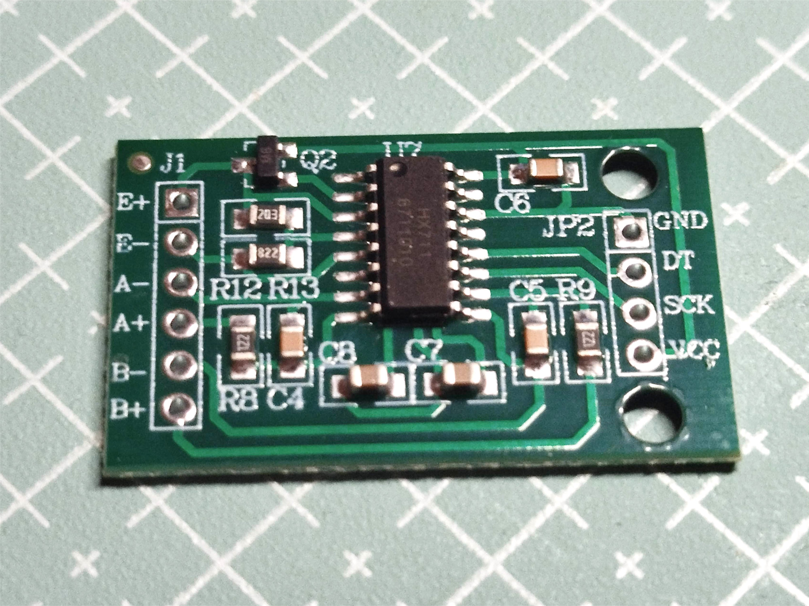
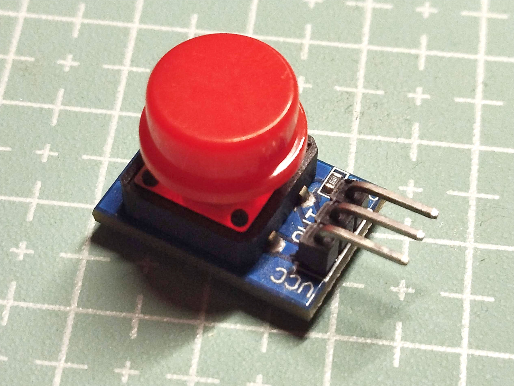

# Torque Plotting Device

This device is designed to plot the relationship between torque and the number of turns in a rubber band. It has been tested using a rubber motor intended for an F1M class model aircraft and can also be used with rubber bands for F1D class models. With some additional adjustments, the device can support experiments on rubber bands of other sizes for educational or research purposes.

The main mechanical components of the device are produced using 3D printing. All necessary parts can be found on [Thingiverse](https://www.thingiverse.com/thing:7033727), as well as in this [repository](./stl).

## Components

The following components were used to build the electronic circuit of the device:

Controller Nano Atmega 328P

Stepper motor NEMA 17 17HS4023

A4988 Stepper Motor Driver

100 g Load Cell

HX711 Amplifier board

0.96" OLED Display Screen Module 128x64

12 mm Button module

70x50 Prototype Circuit Board

## Assembly

Several photos of the assembled circuit board:

## Programming

The file [torque.ino](./torque.ino) contains the program used to operate the device. For the sake of brevity, the process of obtaining the calibration factor for the load cell has been omitted (the value used in the code is -7492.035156).
